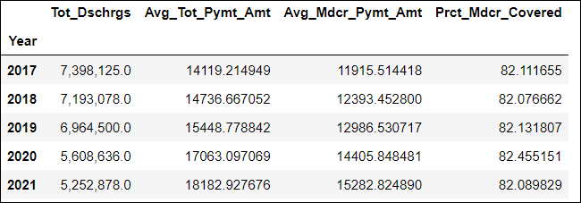
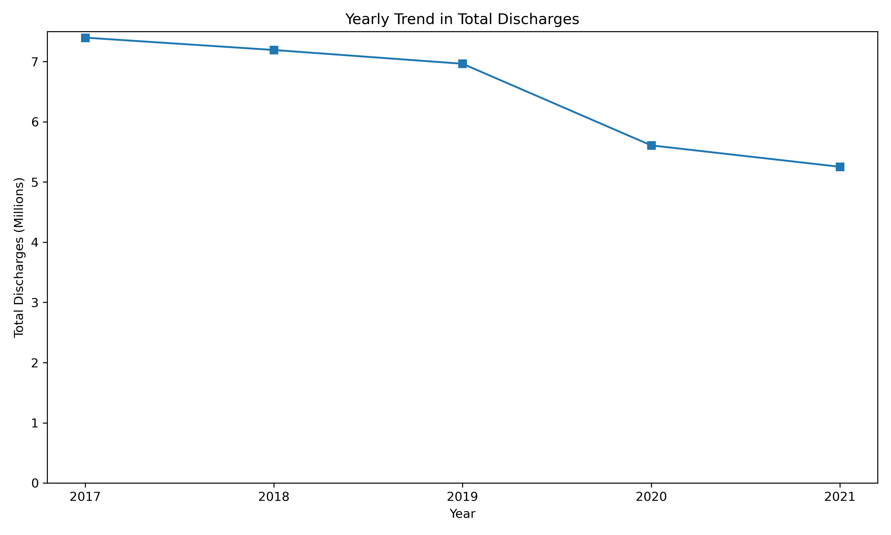
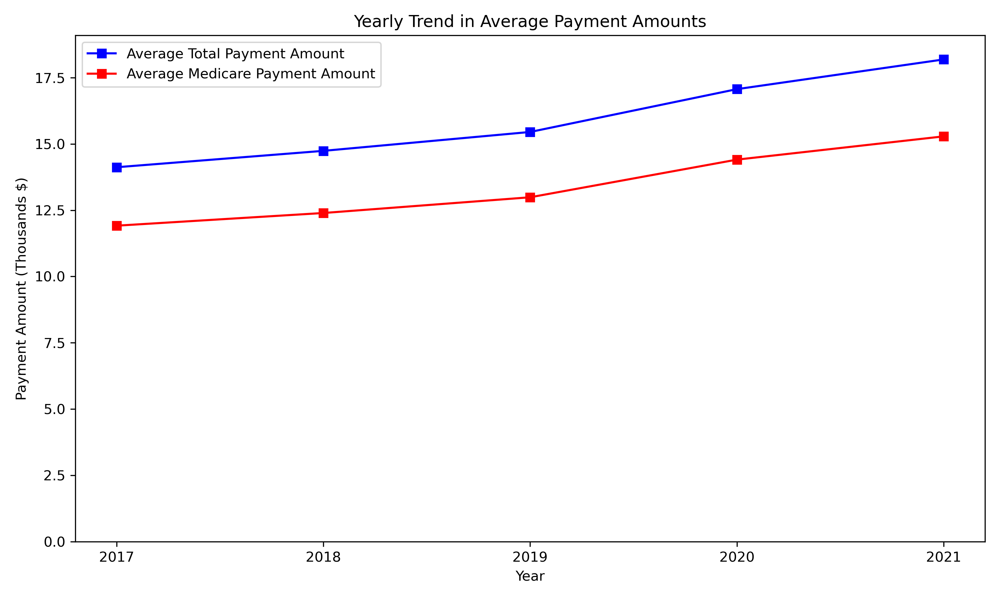
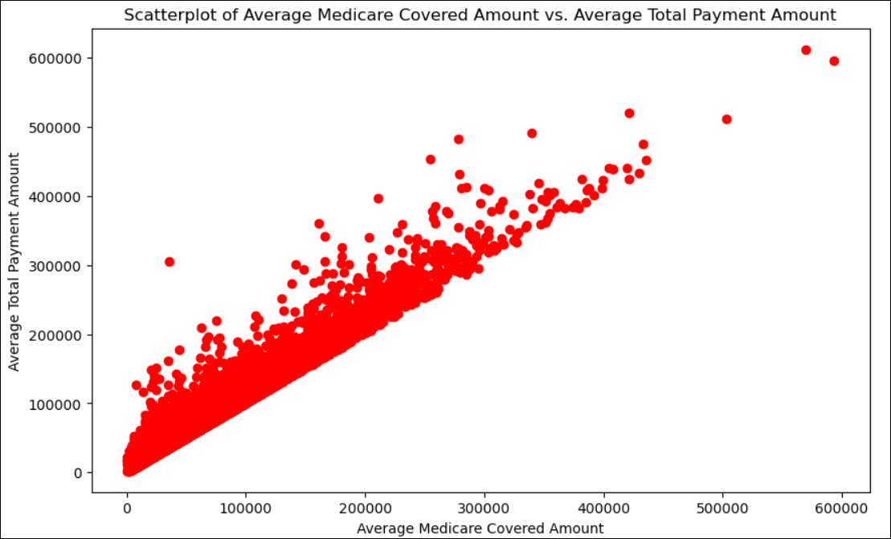
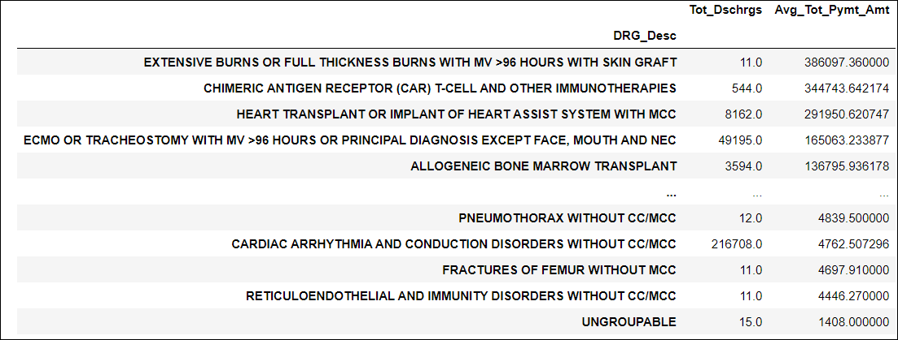
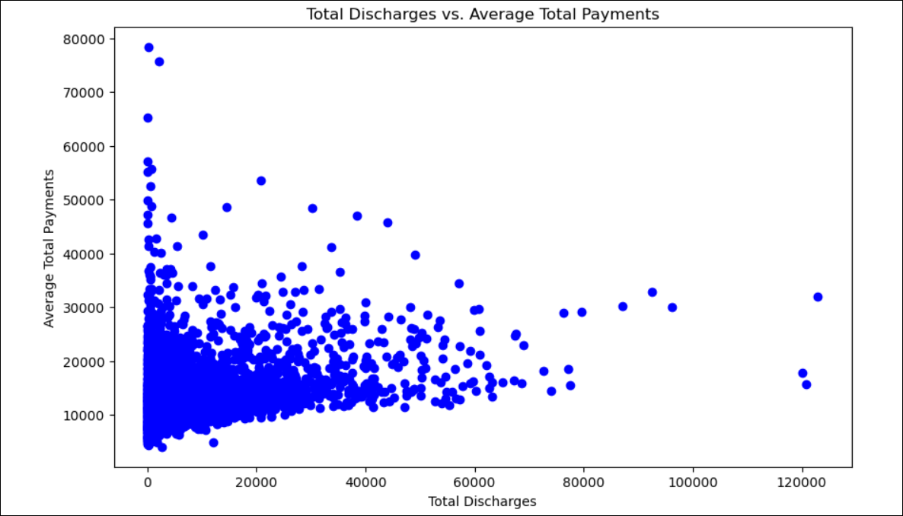

<a id="cms-medicare-inpatient-charge-analysis-python"></a>
# CMS Medicare Inpatient Charge Analysis  
### Case Study Using CMS Open Source Inpatient Data from 2017-2021 (Python)
##### - [Background and Research Questions](#background-and-research-questions)
##### - [Statement of Business Task](#statement-of-business-task)
##### - [Description of Data Sources](#description-of-data-sources)
##### - [Data ETL and Analyses](#data-etl-and-analyses)
##### - [Conclusions and Insights](#conclusions-and-insights)
##### - [References](#references)
---
### Background and Research Questions:  
A critical part of the healthcare sector is the link between the services rendered by providers and hospitals, and how those costs are passed down to insurance companies and the government (in the case of Medicare and Medicaid as examples). This is a particularly important area of research because Medicare costs have been rising and public opinion leans in the direction of more coverage, though how most understand where costs come from is complex and sometimes conflicting.[^1]
- The Research Questions are: 
    - **What trends are there for Medicare Inpatient payments and discharges over the last five years (2017-2021) as represented in the CMS data?**  
    - **What factors captured in the data may account for higher payments?**  
    
<sub>[Back to top](#cms-medicare-inpatient-charge-analysis-python)</sub>

### Statement of Business Task:  
- This is an exploratory analysis investigating what providers, diagnosis-related groupings, and whether discharges are associated with payments and coverage. Although CMS tracks costs across a variety of stages and areas of care, this case study focuses on just inpatient costs.
- Key factors have been established in the literature on medical costs that point to especially good prospects in the dataset to investigate, thus giving clearer direction on what to focus on:
1. The **type of diagnosis/condition of patients** is a driver for medical costs--especially chronic ones.[^2]
2. The **number of discharges or volume of services** by providers is related to medical costs. [^3]
3. The **types of providers/hospitals** are related to medical costs.[^4],[^5]  

<sub>[Back to top](#cms-medicare-inpatient-charge-analysis-python)</sub>

### Description of Data Sources:
- The open source [CMS (Centers for Medicare and Medicaid Services) Inpatient data](https://data.cms.gov/provider-summary-by-type-of-service/medicare-inpatient-hospitals/medicare-inpatient-hospitals-by-provider) provides information on hospital discharges from Original Medicare (fee-for-service) Part A (Hospital Insurance) beneficiaries by Inpatient Prospective Payment System (IPPS) hospitals. It includes information on the use, payment, and hospital charges for more than 3,000 U.S. hospitals that received IPPS payments. The Medicare Inpatient Hospitals - by Provider and Service datasets, from 2017-2021, were individually downloaded for each year.
- The CMS provides a [data dictionary](Data/MUP_INP_RY23_20230426_DD_PrvSrvc_508.pdf) of the 15 fields that are tracked in this Medicare Inpatient Hospitals - by Provider and Service dataset. Following the aforementioned factors to focus on, there are the following fields that were selected for the current analysis:  
    - *Rndrng_Prvdr_Org_Name*: The name of the provider.  
    - *DRG_Desc*: Description of the classification system (DRG) that groups similar clinical conditions (diagnoses) and the procedures furnished by the                  hospital during the stay.  
     - *Tot_Dschrgs*: The number of discharges billed by all providers for inpatient hospital services.  
     - *Avg_Tot_Pymt_Amt*: The average total payments to all providers for the DRG including the MS-DRG amount, teaching, disproportionate share, capital, and            outlier payments for all cases. Also included in average total payments are co-payment and deductible amounts that the patient is responsible for and              any additional payments by third parties for coordination of benefits.  
     - *Avg_Mdcr_Pymt_Amt*: The average amount that Medicare pays to the provider for Medicare's share of the MS-DRG. Medicare payment amounts include the MS-            DRG amount, teaching, disproportionate share, capital, and outlier payments for all cases. Medicare payments DO NOT include beneficiary co- payments              and deductible amounts nor any additional payments from third parties for coordination of benefits.  

 - The [Medicare Severity Diagnosis-Related Group (MS-DRG) to Diagnosis-Related Group (DRG) Crosswalk](https://www.nber.org/research/data/medicare-severity-diagnosis-related-group-ms-drg-diagnosis-related-group-drg-crosswalk) was downloaded from the National Bureau of Economic Research (NBER) website. The MS-DRG adds the patient's severity of illness and risk of mortality to the DRG. The crosswalk allows for the coding of DRG in the original inpatient data to be assigned an ordinal scale of severity, which is needed for the machine learning model of the data. This table can be accessed at the NBER website or in the [data folder for this repository](/Data/MS-DRG%20to%20DRG%20Crosswalk/msdrg2drg.csv).
 
 - Additionally, a simple metric called *"Prct_Mdcr_Covered" (Percent of Medicare Covered)* was calculated to determine what proportion of the average total        payment was payed out by Medicare to the provider (i.e., "Prct_Mdcr_Covered" = "Avg_Mdcr_Pymt_Amt"] / ["Avg_Tot_Pymt_Amt"]) * 100).  

 - Finally, the accompanying [Hospital General Information dataset](https://data.cms.gov/provider-data/dataset/xubh-q36u) was also used to categorize              providers later in the analyses. Primarily, recoding of providers by their Facility ID in the Hospital General Information data, which corresponds to the          Rndrng_Prvdr_CCN in the above CMS Inpatient Data, allowed the categorization of Providers by Provider Type ('Hospital Type') and Ownership ('Hospital              Ownership'). The data dictionary is downloadable at CMS, but is also provided [here, in the Data folder of this repository]        (Data/HOSPITAL_Data_Dictionary.pdf).  

<sub>[Back to top](#cms-medicare-inpatient-charge-analysis-python)</sub>

### Data ETL and Analyses
Each [year's data were locally downloaded](Data/Medicare_Inpatient_Hospital_by_Provider_and_Service_datasets(2017-2021)) and extracted into their component .csv files. The first step was a merge using the pandas library in Python. This step also includes some transformations of fields into workable formats, calculation of the Percent Medicare Covered metric, and a simple summary of the merged dataset (which gets saved locally as "merged_data.csv").

```python
# Import the pandas library
import pandas as pd

# Define the path to the folder containing the CSV files
path = ".../Medicare_Inpatient_Hospital_by_Provider_and_Service_2017-2021"

# Create a list of the CSV files
csv_files = [
    "Medicare_Inpatient_Hospital_by_Provider_and_Service_2017.csv",
    "Medicare_Inpatient_Hospital_by_Provider_and_Service_2018.csv",
    "Medicare_Inpatient_Hospital_by_Provider_and_Service_2019.csv",
    "Medicare_Inpatient_Hospital_by_Provider_and_Service_2020.csv",
    "Medicare_Inpatient_Hospital_by_Provider_and_Service_2021.csv"
]

# Create a list of dataframes, one for each CSV file
dfs = []
for csv_file in csv_files:
    df = pd.read_csv(path + "/" + csv_file, encoding="cp1252")
    df["Year"] = csv_file.split("_")[-1].split(".csv")[0]
    dfs.append(df)
    
# Merge the dataframes into one dataframe
merged_df = pd.concat(dfs, ignore_index=True)

# Convert the strings to floats
merged_df["Avg_Tot_Pymt_Amt"] = merged_df["Avg_Tot_Pymt_Amt"].str.replace("$", "").str.replace(",", "").astype(float)
merged_df["Avg_Mdcr_Pymt_Amt"] = merged_df["Avg_Mdcr_Pymt_Amt"].str.replace("$", "").str.replace(",", "").astype(float)

# Convert the "Tot_Dschrgs" column to a number
merged_df["Tot_Dschrgs"] = merged_df["Tot_Dschrgs"].str.replace("$", "").str.replace(",", "").astype(float)

# Calculate the percentage of Medicare payments that are covered by Medicare
merged_df["Prct_Mdcr_Covered"] = (merged_df["Avg_Mdcr_Pymt_Amt"] / merged_df["Avg_Tot_Pymt_Amt"]) * 100

# Save the merged dataframe to a CSV file
merged_df.to_csv("merged_data.csv", index=False)

# Get a summary of the columns and data types
merged_df.info()
```
This returns the following:
```
<class 'pandas.core.frame.DataFrame'>
RangeIndex: 886238 entries, 0 to 886237
Data columns (total 17 columns):
 #   Column                     Non-Null Count   Dtype  
---  ------                     --------------   -----  
 0   Rndrng_Prvdr_CCN        886238 non-null  int64  
 1   Rndrng_Prvdr_Org_Name      886238 non-null  object 
 2   Rndrng_Prvdr_City          886238 non-null  object 
 3   Rndrng_Prvdr_St            886238 non-null  object 
 4   Rndrng_Prvdr_State_FIPS    886238 non-null  int64  
 5   Rndrng_Prvdr_Zip5          886238 non-null  int64  
 6   Rndrng_Prvdr_State_Abrvtn  886238 non-null  object 
 7   Rndrng_Prvdr_RUCA          886202 non-null  float64
 8   Rndrng_Prvdr_RUCA_Desc     886202 non-null  object 
 9   DRG_Cd                     886238 non-null  int64  
 10  DRG_Desc                   886238 non-null  object 
 11  Tot_Dschrgs                886238 non-null  float64
 12  Avg_Submtd_Cvrd_Chrg       886238 non-null  object 
 13  Avg_Tot_Pymt_Amt           886238 non-null  float64
 14  Avg_Mdcr_Pymt_Amt          886238 non-null  float64
 15  Year                       886238 non-null  object 
 16  Prct_Mdcr_Covered          886238 non-null  float64
dtypes: float64(5), int64(4), object(8)
memory usage: 114.9+ MB
```  
Although all 15 original fields remain in the dataset, the following analyses pertain only to the ones of interest mentioned above along with the Percent Medicare Covered metric.

- Initial Summary Year by Total Number of Discharges, Average Total Payment Amount, Average Medicare Payment Amount, and Percent Medicare Covered:

```python
# Group the dataframe by year
grouped_df = merged_df.groupby("Year")

# Calculate the summary statistics by Year, summing Total Discharges and getting averages for the other quantitative fields
summary_df = grouped_df.agg({
    "Tot_Dschrgs": "sum",
    "Avg_Tot_Pymt_Amt": "mean",
    "Avg_Mdcr_Pymt_Amt": "mean",
    "Prct_Mdcr_Covered": "mean"
})

# Format the "Tot_Dschrgs" column in millions
summary_df["Tot_Dschrgs"] = summary_df["Tot_Dschrgs"].astype(float).map("{:,}".format)

# Print the summary statistics
summary_df
```
Which results in the following table:  
  

These relationships may be better understood in yearly trends. The code to create a line graph with total number of discharges is as follows:  
```python
import matplotlib.pyplot as plt

# Define the years
years = [2017, 2018, 2019, 2020, 2021]

# Calculate the total number of discharges for each year
discharges_by_year = merged_df.groupby('Year')['Tot_Dschrgs'].sum() / 1000000  # Convert to millions

# Create the line graph
plt.figure(figsize=(10, 6))
plt.plot(years, discharges_by_year, marker='s')  # Use 'marker' argument to display square points
plt.xlabel('Year')
plt.ylabel('Total Discharges (Millions)')
plt.title('Yearly Trend in Total Discharges')
plt.xticks(years)
plt.ylim(0, 7.5)  # Set the y-axis limits
plt.tight_layout()

# Save the line graph as a .png image
plt.savefig('line_graph_discharges.png', dpi=300)

# Show the line graph
plt.show()
```  
Graphed out, there appears to be a decreasing trend in the total number of discharges between 2017 and 2021:  
  
The code for showing the Average Total Amount and Average Medicare Amount:
```python
import matplotlib.pyplot as plt

# Define the years
years = [2017, 2018, 2019, 2020, 2021]

# Calculate the total number of discharges for each year
discharges_by_year = merged_df[merged_df['DRG_Desc'].isin(bottom_5_drg)].groupby('Year')['Tot_Dschrgs'].sum()

# Create the bar graph
plt.figure(figsize=(10, 6))
plt.bar(years, discharges_by_year)
plt.xlabel('Year')
plt.ylabel('Total Discharges')
plt.title('Yearly Trend in Total Discharges for Bottom 5 DRG_Descs')
plt.xticks(years)
plt.tight_layout()

# Show the bar graph
plt.show()
```  
And while the total number of discharges appears to be going down over the years, the Average Amount (Total and Medicare) have been steadily increasing: 
   

There appears to be a close correlation between Average Total Payment Amount and Average Medicare Payment Amount. If these two are closely correlated, it may be best to drop one from further analyses, for parsimony. Let's plot the two variables in a scatterplot first, then calculate the Pearson correlation coefficient to determine what the precise relationship is.  
Scatterplot code:  
```python
import matplotlib.pyplot as plt

# Create the scatterplot
plt.figure(figsize=(10, 6))
plt.scatter(merged_df['Avg_Mdcr_Pymt_Amt'], merged_df['Avg_Tot_Pymt_Amt'], color='red')

# Set plot labels and title
plt.xlabel('Average Medicare Covered Amount')
plt.ylabel('Average Total Payment Amount')
plt.title('Scatterplot of Average Medicare Covered Amount vs. Average Total Payment Amount')

# Display the plot
plt.show()
```  
There appears to be a strong linear relationship:  
  

Pearson correlation coefficient code:  
```python
import scipy.stats as stats

# Filter out providers with null values in Avg_Tot_Pymt_Amt or Avg_Mdcr_Pymt_Amt
filtered_df = merged_df.dropna(subset=['Avg_Tot_Pymt_Amt', 'Avg_Mdcr_Pymt_Amt'])

# Calculate correlation coefficient and p-value
correlation, p_value = stats.pearsonr(filtered_df['Avg_Tot_Pymt_Amt'], filtered_df['Avg_Mdcr_Pymt_Amt'])

# Display the correlation coefficient and p-value
print("Correlation coefficient:", correlation)
print("p-value:", p_value)
```  
Pearson correleation coefficient: *r* = **0.98**, *p* < **0.001**  

Suffice it to say, the strong linear relationship provides enough evidence that we can drop one of the variables in our upcoming analyses. Let's keep **Average Total Payment Amount**.  

To extend our look at trending, it may be useful to see how two different methods might predict what the Highest Average Total Payment is expected to be in 2022 based on the 2017-2021 data. In the first method, I use one simple estimation model that takes the mean percent change between years and applies it to the interval between 2021's value to get 2022. For the second method, a more traditional approach, I use a simple linear regression equation.  

First, let's take a quick look at the Highest Average Payment Amounts for each year:  
```python
# Group the dataframe by year
grouped_df = merged_df.groupby("Year")

# Calculate the summary statistics by Year
summary_df = grouped_df.agg({
    "Avg_Tot_Pymt_Amt": ["max", "mean"]
})

# Rename the columns
summary_df.columns = ["Max Avg_Tot_Pymt_Amt", "Mean Avg_Tot_Pymt_Amt"]

# Print the summary statistics
print(summary_df)
```  
Output:  
```
       Max Avg_Tot_Pymt_Amt    Mean Avg_Tot_Pymt_Amt
Year                                             
2017             612054.05           13770.918314
2018             424773.86           14396.808389
2019             482520.55           15081.727973
2020             595270.95           16590.545868
2021             520139.92           17620.767520 
```  
The MAX values for each year for Average Total Payment Amount are fed into the following two predictive models.  

Here is the code for the mean-percent-change model:  
```python
import numpy as np

# Define the table data
data = {
    'Year': [2017, 2018, 2019, 2020, 2021],
    'Highest Avg Total Pymt': [612054.05, 424773.86, 482520.55, 595270.95, 520139.92]
}

# Create a DataFrame from the table data
df = pd.DataFrame(data)

# Calculate the percent change for each consecutive year
percent_changes = df['Highest Avg Total Pymt'].pct_change()

# Compute the average percent change
average_percent_change = np.mean(percent_changes)

# Obtain the final actual value for 2021
final_actual_value = df.loc[df['Year'] == 2021, 'Highest Avg Total Pymt'].values[0]

# Calculate the predicted value for 2022
predicted_value_2022 = final_actual_value + (average_percent_change * final_actual_value)

# Print the predicted value for 2022
print('Predicted value for 2022:', predicted_value_2022)
```  
This model predicts the Highest Average Payment Amount in 2022 to be **$512,001.94**  

What does a standard linear regression equation predict? Here is the code:  
```python
import pandas as pd
from sklearn.linear_model import LinearRegression

# Define the table data
data = {
    'Year': [2017, 2018, 2019, 2020, 2021],
    'Highest Avg Total Pymt': [612054.05, 424773.86, 482520.55, 595270.95, 520139.92]
}

# Create a DataFrame from the table data
df = pd.DataFrame(data)

# Separate the features (Year) and target variable (Highest Avg Total Pymt)
X = df[['Year']]
y = df['Highest Avg Total Pymt']

# Create and train the linear regression model
model = LinearRegression()
model.fit(X, y)

# Predict the value for 2022 using the linear regression equation
predicted_value_2022 = model.predict([[2022]])

# Print the predicted value for 2022
print('Predicted value for 2022:', predicted_value_2022[0])
```  
Standard linear regression predicts the Highest Average Total Payment in 2022 to be **$522,952.52**  

There is a difference of $10,950.58 between the two model predictions. While there are many other predictive models that can also be used, these two methods are simple and straightforward. That they don't differ by very much (for exploratory purposes) I might choose to use either model based on whether a conservative or liberal criterion is preferred. For example, if we are trying to overestimate (more of a liberal criterion) so that we can anticipate higher costs, the linear regression model might be appropriate. If we favor potential underestimation (a conservative criterion), then use the percent-change model that has the lower predicted value.  Finally, we could split the difference, take the median between the two predicted values (which is **$517,477.23**) to minimize risk of over/underestimation.  

To address what factors may play a role in Discharges and Average Total Amount, it's worth looking at Diagnosis Related Group (DRG_Desc) and Provider (Rndrng_Prvdr_Org_Name). Due to the large number of both categories, let's look at the Top and Bottom 5 across all years in a simple summary table, sorted by Average Total Amount. Here is the code used:  
```python
# Get a summary of Avg_Tot_Pymt_Amt and Avg_Mdcr_Pymt_Amt by the DRG_Desc
summary_df = merged_df.groupby("DRG_Desc").agg({
    "Tot_Dschrgs": "sum",
    "Avg_Tot_Pymt_Amt": "mean"
})

# Sort the table in descending order by the Avg_Tot_Pymt_Amt
summary_df = summary_df.sort_values("Avg_Tot_Pymt_Amt", ascending=False)

# Print the summary statistics
summary_df
```  
Which returns the following table:  
   

Perhaps most notable from this distribution of Diagnosis Related Groups is that the frequency (measured by Total Discharges) is quite variable across DRGs. And while the table is sorted to show the top 5 and bottom 5 according to Average Total Payment, there is a mix of more common diagnoses and less frequent ones in the top and bottom groups. The highest average total payment is associated with "EXTENSIVE BURNS OR FULL THICKNESS BURNS WITH MV >96 HOURS WITH SKIN GRAFT", but has a relatively low frequency based on Discharges (11); besides the "UNGROUPABLE" category, most lower payment diagnosis related groups are reletively infrequent except for "CARDIAC ARRHYTHMIA AND CONDUCTION DISORDERS WITHOUT CC/MCC" which has high number of discharges (>216,000).  

What providers are associated with the highest and lowest average total payment amounts? The following code was used to provide a top/bottom 5 providers by Average total Payment:
```python
# Group by provider name and calculate the average total payment
avg_payments_by_provider = merged_df.groupby('Rndrng_Prvdr_Org_Name')['Avg_Tot_Pymt_Amt'].mean()

# Create a new DataFrame with provider name and average total payment
table_data = pd.DataFrame({
    'Provider Name': avg_payments_by_provider.index,
    'Average Total Payment': avg_payments_by_provider
})

# Sort the table by average total payment in descending order
table_data = table_data.sort_values('Average Total Payment', ascending=False)

# Display the table
print(table_data)
```  
Wise Health and Harris Health Systems were associated with the highest Average Total Payments, while Wilmington Treatment Center and Black River Community Medical Center were at the bottom:  
```
                                         Average Total Payment  
Rndrng_Prvdr_Org_Name                                           
Wise Health System                                78407.810000  
Harris Health System                              75698.375888  
Us Pain & Spine Hospital                          65318.810000  
Cooper County Community Hospital                  57158.526667  
Woodhull Medical & Mental Health Center           55768.831000  
...                                                        ...  
Beacham Memorial Hospital                          4641.621818  
Aspire Behavioral Health Of Conroe, Llc            4622.500000  
Rmc Jacksonville                                   4610.732000  
Black River Community Medical Center               4439.520909  
Wilmington Treatment Center                        4089.928000  
```  
What about the relationship between volume (total number of discharges) and amount paid out (as measured by average total payment amount)?  
As the data across all years, providers, and diagnostic related groupings adds up to well over 880,000 rows, a scatterplot and correlational analysis using these data would be untenable. Therefore, a new dataframe was created that consolidated the data into Provider-Diagnostic Related Grouping combinations, and averaged Total Discharges and Average Total Payment Amount across all years. This dataframe condensed down to ~292,000 rows (a 67% reduction). The code for how this dataframe was created is as follows:  
```python
# Group by Provider and DRG_Desc and calculate the average of Tot_Dschrgs and Avg_Tot_Pymt_Amt
averaged_df = merged_df.groupby(['Rndrng_Prvdr_Org_Name', 'DRG_Desc']).agg({
    'Tot_Dschrgs': 'mean',
    'Avg_Tot_Pymt_Amt': 'mean'
}).reset_index()

# Add a row for the total result
total_result = averaged_df[['Tot_Dschrgs', 'Avg_Tot_Pymt_Amt']].mean()
total_result['Rndrng_Prvdr_Org_Name'] = 'Total Result'
total_result['DRG_Desc'] = 'Total Result'
averaged_df = averaged_df.append(total_result, ignore_index=True)

# Print the averaged dataframe
print(averaged_df)
```  
Now a scatterplot would be created that graphs the relationship between Total Discharges and Average Total Payment Amount:  
```python
import matplotlib.pyplot as plt

# Create the scatterplot
plt.figure(figsize=(10, 6))
plt.scatter(averaged_df['Tot_Dschrgs'], averaged_df['Avg_Tot_Pymt_Amt'], color='blue')

# Set plot labels and title
plt.xlabel('Total Discharges')
plt.ylabel('Average Total Payment Amount')
plt.title('Scatterplot of Total Discharges vs. Average Total Payment Amount')

# Display the plot
plt.show()
```  
  

Although no obvious linear correlation appears to exist based on the scatterplot, it does highlight interesting outliers on both ends of each variable. And, surprisingly, those Provider-Diagnostic Groups with the highest number of discharges tend to have the lowest Average Total Payment Amounts; conversely, the outliers with the highest Average Total Payment Amounts have the lowest number of discharges.  
To highlight these outliers, I display the Provider-Diagnostic Group combinations that had the following criteria:  
1. Any plot (Provider-DRG_Desc)  with Total Discharges over 2,000;
2. Any plot (Provider-DRG_Desc) with Average Total Payment Amount over $500,000  
The code to provide this:  
```python
# Filter the outliers based on the criteria
outliers = averaged_df[(averaged_df['Tot_Dschrgs'] > 2000) | (averaged_df['Avg_Tot_Pymt_Amt'] > 500000)]

# Sort the outliers summary in descending order by Average Total Payment Amount
outliers_summary = outliers.sort_values('Avg_Tot_Pymt_Amt', ascending=False)

# Display the summary of outliers
print(outliers_summary[['Rndrng_Prvdr_Org_Name', 'DRG_Desc', 'Avg_Tot_Pymt_Amt', 'Tot_Dschrgs']])
```
Producing the following summary:  
```
  Rndrng_Prvdr_Org_Name  \
113145          Keck Hospital Of Usc   
291056       Yale-New Haven Hospital   
65156       Duke University Hospital   
99246   Hospital For Special Surgery   
162690  New England Baptist Hospital   
2331            Adventhealth Orlando   
259058        Turning Point Hospital   

                                                 DRG_Desc  Avg_Tot_Pymt_Amt  \
113145  HEART TRANSPLANT OR IMPLANT OF HEART ASSIST SY...       632473.0800   
291056  CHIMERIC ANTIGEN RECEPTOR (CAR) T-CELL AND OTH...       616026.3600   
65156   CHIMERIC ANTIGEN RECEPTOR (CAR) T-CELL AND OTH...       510916.0900   
99246   MAJOR HIP AND KNEE JOINT REPLACEMENT OR REATTA...        22827.4140   
162690  MAJOR HIP AND KNEE JOINT REPLACEMENT OR REATTA...        15590.0420   
2331    SEPTICEMIA OR SEVERE SEPSIS WITHOUT MV >96 HOU...        14841.0775   
259058  ALCOHOL, DRUG ABUSE OR DEPENDENCE WITH REHABIL...         7854.3880   

        Tot_Dschrgs  
113145         13.0  
291056         11.0  
65156          11.0  
99246        3548.2  
162690       2130.8  
2331         2157.5  
259058       2244.2  
```  
There are interesting insights we can distill from these results:  
- The most expensive (top three outliers on Average Total Payment Amount) are **university-teaching hospitals** (Keck-USC; Yale-New Haven; Duke Univeristy)
- Based on the diagnostic groupings and total discharges, outliers with highest Average Total Payment are **relatively rare (and very involved) diagnostic groupings** (heart transplant and chimeric antigent receptor t-cell...) that likely have very technical and advanced procedures to treat.
- Those Diagnostic Groupings with the **most frequent discharges (i.e., most common)** also have the **lowest Average Total Amount**--major hip and joint replacements, septicemia/severe sepsis, and alcohol, drug abuse or dependence.  

Note that the relationship between total number of discharges and average total payment amount cannot be assumed with the full (averaged across years, and Provider-DRG combination) dataset. The above insights are only potential patterns for further investigation based off of the outliers/anomalies. In fact, there is no linear relationship between the two quantitative variables, as can be calculated with a Pearson's r correlation-coefficient:  
```python
import scipy.stats as stats

# Filter out providers with null values in Avg_Tot_Pymt_Amt or Tot_Dschrgs
filtered_df = averaged_df.dropna(subset=['Avg_Tot_Pymt_Amt', 'Tot_Dschrgs'])

# Calculate correlation coefficient and p-value
correlation, p_value = stats.pearsonr(filtered_df['Avg_Tot_Pymt_Amt'], filtered_df['Tot_Dschrgs'])

# Display the correlation coefficient and p-value
print("Correlation coefficient:", correlation)
print("p-value:", p_value)
```  
Which results in *r* = **-0.029**, *p* > **1.27**.  

To further investigate if the types of providers and the total discharges together can predict average total payments, a Forest Tree Regressor ML model was run on the data. However, the providers would need to be grouped into a maanageable number of meaningful categories. Fortunately, the [Hospital_General_Information.csv](Data/Hospital_General_Information/Hospital_General_Information.csv) has categorization of each Medicare provider by Hospital Type and Hospital Ownership that have a limited number of parameters and can be used to test the hypothesis that provider type and/or ownership may be able to predict costs.  
The following code uses Facility ID and Rndrng_Prvdr_CCN to insert Hospital Type and Hospital Ownership columns into the merged_df dataframe.  
```python

```

<sub>[Back to top](#cms-medicare-inpatient-charge-analysis-python)</sub>

### Conclusions and Insights 
Here is a reiteration of the research questions:
    - **What trends are there for Medicare Inpatient payments and discharges over the last five years (2017-2021) as represented in the CMS data?**  
    - **What factors captured in the data may account for higher payments?**  
#### Trends  
From 2017-2021, there is an interesting interaction between how many discharges were posted vs. the average amount paid: 
* The **Total Number of Discharges have been steadily decreasing**. 
* Conversely, the **Average Total Payment Amount has been increasing**.  
Some of the underlying reasons for these trends may be beyond the scope of the current dataset. Any root-cause analysis may have to take into consideration any changing policies or rates that CMS implemented within those years. Also researchers have found that a variety of demographic factors and intensity of services affect costs, and that would have to be further analyzed.[^6]  

#### Factors Affecting Costs

<sub>[Back to top](#cms-medicare-inpatient-charge-analysis-python)</sub>  

---  
###### *Note: Assisted with AI tools for coding only. All content that drove research questions, methodology, interpretation of outcomes/insights, and communication in this markdown document were my own and not assisted with AI.* 
---  
### References 
[^1]: Blendon, R. J., Brodie, M., Benson, J. M., Altman, D. E., & Buhr, T. (2006). Americans' views of health care costs, access, and quality. The Milbank quarterly, 84(4), 623–657. https://doi.org/10.1111/j.1468-0009.2006.00463.x
[^2]: Deyo, D., Hemingway, J., & Hughes, D. (2015). Identifying Patients With Undiagnosed Chronic Conditions: An Examination of Patient Costs Before Chronic Disease Diagnosis.. Journal of the American College of Radiology : JACR.
[^3]: Hadley, J., Reschovsky, J., Corey, C., & Zuckerman, S. (2009). Medicare fees and the volume of physicians' services.. Inquiry : a journal of medical care organization, provision and financing.
[^4]: Thompson, J., & Mccue, M. (2004). Organizational and market factors associated with Medicare dependence in inpatient rehabilitation hospitals. Health Services Management Research.
[^5]: Courtney, P., Darrith, B., Bohl, D., Frisch, N., & Valle, C. (2017). Reconsidering the Affordable Care Act’s Restrictions on Physician-Owned Hospitals: Analysis of CMS Data on Total Hip and Knee Arthroplasty. The Journal of Bone and Joint Surgery.  
[^6]: Pfuntner A, Wier LM, Steiner C. Costs for Hospital Stays in the United States, 2010. In: Healthcare Cost and Utilization Project (HCUP) Statistical Briefs. Agency for Healthcare Research and Quality (US), Rockville (MD); 2006. PMID: 23447833.
